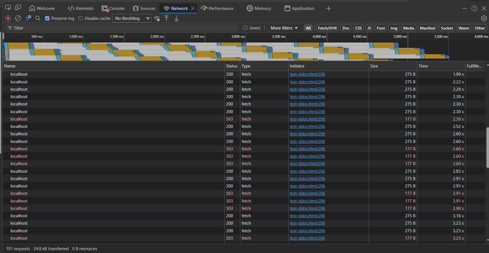

# Nhật Ký Công Việc

## Level 1 — Nâng cấp Nginx Config

### ✅ Nhiệm vụ 1: Passive Health Check + Backup Server

**Mô tả:**
Thêm cơ chế tự động phát hiện server chết và server dự phòng.

**File đã thay đổi:**

| File | Thay đổi |
|---|---|
| `nginx-1.29.6\conf\nginx.conf` | Chuyển sang dùng `include features/...` |
| `nginx-1.29.6\conf\features\upstream.conf` | Thêm `max_fails`, `fail_timeout`, `backup` |
| `nginx-1.29.6\conf\features\proxy.conf` | Proxy headers + no-cache |
| `Server3\index.html` | Trang backup (nền đỏ) |

**Chi tiết kỹ thuật:**

1. **Passive Health Check** — trong `features/upstream.conf`
   - `max_fails=3`: server fail 3 lần liên tiếp → bị loại khỏi pool
   - `fail_timeout=30s`: bị loại 30 giây, sau đó Nginx thử lại
   - Áp dụng cho: Server1 (port 8001), Server2 (port 8002)

2. **Backup Server** — trong `features/upstream.conf`
   - `server 127.0.0.1:8003 backup;`
   - Bình thường **không nhận traffic**
   - Chỉ hoạt động khi **cả Server1 và Server2 đều chết**

**Cách test:**
1. Chạy 3 server: `python -m http.server 8001/8002/8003` (trong Server1, Server2, Server3)
2. Chạy Nginx: `cd nginx-1.29.6` → `nginx.exe`
3. Truy cập `http://localhost:8080` → F5 → thấy Server1/Server2 xen kẽ
4. Tắt Server1 → F5 → chỉ còn Server2 (health check loại Server1)
5. Tắt Server2 → F5 → **Server3 BACKUP (trang đỏ) tự động lên thay**
6. Bật lại Server1 hoặc Server2 → Server3 tự nghỉ

---

### ✅ Nhiệm vụ 2: Weighted Round Robin

**Mô tả:**
Phân tải theo tỉ lệ — Server1 nhận nhiều traffic hơn Server2.

**File đã thay đổi:**

| File | Thay đổi |
|---|---|
| `nginx-1.29.6\conf\features\upstream.conf` | Thêm `weight=3` (Server1), `weight=1` (Server2) |

**Chi tiết kỹ thuật:**

1. **Weighted Round Robin** — trong `features/upstream.conf`
   - `weight=3` trên Server1 → nhận 3 request cho mỗi 1 request của Server2
   - Tỉ lệ phân tải: **75% Server1, 25% Server2**
   - Kết hợp với `max_fails` + `backup` đã có sẵn

**Cách test:**
1. Chạy 3 server + Nginx như bình thường
2. Truy cập `http://localhost:8080` → F5 liên tục
3. **Kết quả**: Server1 xuất hiện ~3 lần cho mỗi 1 lần Server2

---

### ✅ Nhiệm vụ 3: Rate Limiting

**Mô tả:**
Giới hạn số request mỗi IP gửi được, chống DDoS.

**File đã thay đổi:**

| File | Thay đổi |
|---|---|
| `nginx-1.29.6\conf\features\rate-limit.conf` | Thêm `limit_req_zone` (10r/s, zone 10MB) |
| `nginx-1.29.6\conf\nginx.conf` | Include rate-limit.conf ở http block + `limit_req` ở location |

**Chi tiết kỹ thuật:**

1. **limit_req_zone** — trong `features/rate-limit.conf` (http level)
   - `$binary_remote_addr`: giới hạn theo IP client
   - `zone=one:10m`: dùng 10MB RAM để lưu trạng thái
   - `rate=10r/s`: tối đa 10 request/giây/IP

2. **limit_req** — trong `nginx.conf` (location level)
   - `burst=20`: cho phép burst tối đa 20 request
   - `nodelay`: xử lý burst ngay, không xếp hàng đợi

**Cách test:**
1. Chạy Nginx như bình thường
2. Gửi 50 request liên tục bằng PowerShell:
   ```powershell
   1..50 | ForEach-Object { Invoke-WebRequest -Uri http://localhost:8080 -UseBasicParsing | Select-Object StatusCode }
   ```
3. **Kết quả**: Một số request bị trả về lỗi 503 khi vượt quá giới hạn

**Minh chứng:**



---

## Level 2 — Backend thực tế (Flask)

### ✅ Khởi tạo Flask app + Utilities

**Mô tả:**
Tạo khung sườn Flask app và hàm tiện ích dùng chung, để team code các endpoint.

**File đã thay đổi:**

| File | Thay đổi |
|---|---|
| `backend\app.py` | Khởi tạo Flask, import 3 Blueprint, nhận `--port` từ CLI |
| `backend\utils\stats.py` | `count_request()`, `get_uptime()`, `get_stats()` |
| `backend\routes\health.py` | ⬜ Chờ team |
| `backend\routes\info.py` | ⬜ Chờ team |
| `backend\routes\stress.py` | ⬜ Chờ team |
| `backend\requirements.txt` | `flask` |
