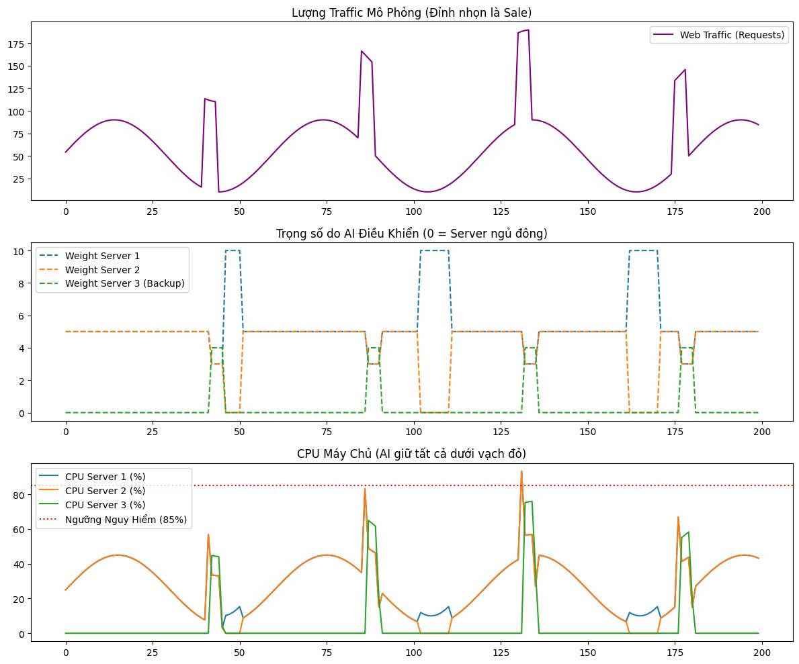

# Kiến Trúc và Hoạt Động (AI Load Balancer)

## 1. Kiến Trúc 3 Tầng
- **Data Plane (HAProxy):** Nhận tham số `weight` từ AI để định tuyến luồng HTTP Request tới s1, s2, s3.
- **Control Plane (PPO Agent):** Điều khiển HAProxy Runtime API qua `socat`. Cập nhật `weight` theo thời gian thực (Real-time).
- **Sensor Plane (Flask Metrics):** Endpoint `/metrics` cung cấp CPU, RAM, Latency cho Hệ thống phân tích.

## 2. Kỹ Thuật Huấn Luyện (Sim2Real)
- **Train (Colab):** Sử dụng hàm toán học Lý thuyết hàng đợi (M/M/1 Queue) để tạo Data giả lập. Train 150,000 steps xuất ra tệp `ha_rl_trained_model.zip`.
- **Inference (Ubuntu VM):** Nạp tệp `.zip` đính kèm mạng Nơ-ron. PPO Agent dùng kinh nghiệm này đọc dữ liệu thật và xuất lệnh điều khiển HAProxy.

## 3. Quá Trình Nhận Diện Kịch Bản
- **Traffic thấp (Đêm):** Tắt điện (weight=0) s2 và s3. Dồn 100% về s1 nhằm tối ưu tài nguyên rảnh rỗi. *(Scale-In)*
- **Traffic đột biến (DDoS/Spike):** S1 chịu tải đạt ngưỡng rủi ro, gọi máy chủ s3 từ trạng thái ngủ (0) lên hoạt động. Chia đều băng thông. *(Scale-Out)*

